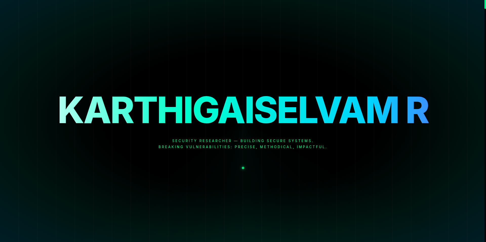

# 🔐 Aditya Mishra - Portfolio

> **Security Researcher & Software Developer**  
> *Exploring the intersection of secure infrastructure and modern web experiences.*


A highly interactive, cyber-security themed portfolio website built to showcase penetration testing achievements, software development projects, and professional experience.

---

## 📸 Screenshots

<p align="center">
  
</p>

<p align="center">
  
  
</p>

<p align="center">
  
  
</p>

<p align="center">
  
</p>

---

## ✨ Key Features

- **🎨 Cyber Aesthetic**: Custom neon design system with glassmorphism, matrix rain, and glitch effects.
- **📱 Responsive Design**: Fully optimized for Desktop, Laptop, Tablet, and Mobile devices.
- **✉️ Secure Contact Form**: 
    - Integrated with **EmailJS** for serverless, secure email delivery.
    - Custom **Toast Notification System** for real-time user feedback.
    - Rate limiting and input validation.
- **🏗️ Dynamic Architecture**:
    - **Experience Timeline**: Vertical interactive timeline connecting internships to LinkedIn posts.
    - **Achievement Carousel**: Auto-playing image gallery for hackathon wins and certifications.
    - **Project Hub**: GitHub API integration to fetch and display live repository statistics.

## 🛠️ Tech Stack

- **Frontend**: React 18
- **Build Tool**: Vite
- **Animations**: Framer Motion
- **Styling**: CSS Modules with CSS Variables (Theming)
- **Email Service**: EmailJS
- **Icons**: Lucide React / Custom SVG

## 🚀 Quick Start

1. **Clone the repository**
   ```bash
   git clone https://github.com/Aditya Mishra-R-official/Aditya Mishra-dev.git
   ```

2. **Install dependencies**
   ```bash
   cd Aditya Mishra-dev
   npm install
   ```

3. **Start local server**
   ```bash
   npm run dev
   ```

4. **Build for production**
   ```bash
   npm run build
   ```

## 📁 Project Structure

```bash
src/
├── components/
│   ├── Navbar/       # Responsive navigation with 'terminal' style
│   ├── Hero/         # 3D interactive landing section
│   ├── About/        # Profile & Achievements with Carousel
│   ├── Experience/   # Vertical Professional Timeline
│   ├── Projects/     # GitHub API integrated project cards
│   ├── Contact/      # EmailJS form with validation
│   └── Toast/        # Custom notification system
├── styles/
│   └── global.css    # Cyber-theme variables & animations
└── main.jsx          # Entry point
```

## 📧 Contact Configuration

To make the contact form work in your own fork:

1. Create an account on [EmailJS](https://www.emailjs.com/).
2. Create a standardized email template.
3. Update specific keys in `src/components/Contact/Contact.jsx` or use Environment Variables.

## 📄 License

This project is licensed under the MIT License - see the [LICENSE](LICENSE) file for details.

---
*Built with 💚 and 💻 by [Aditya Mishra](https://github.com/Aditya Mishra-R-official)*
